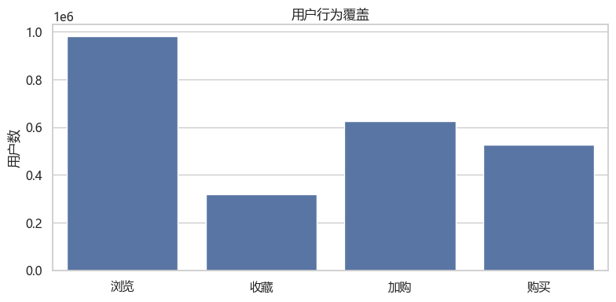
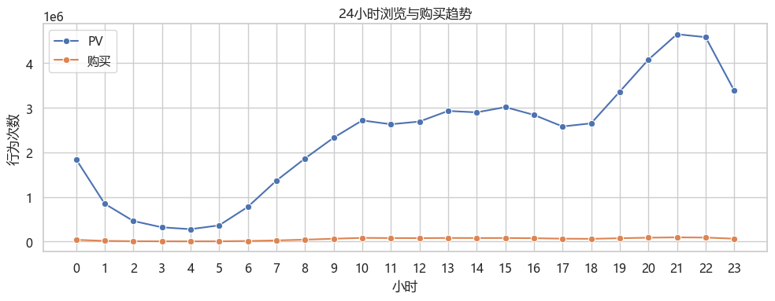
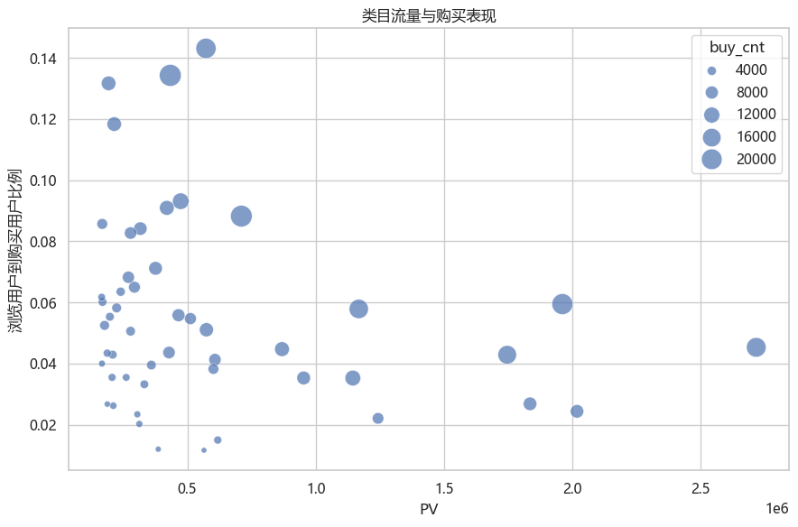
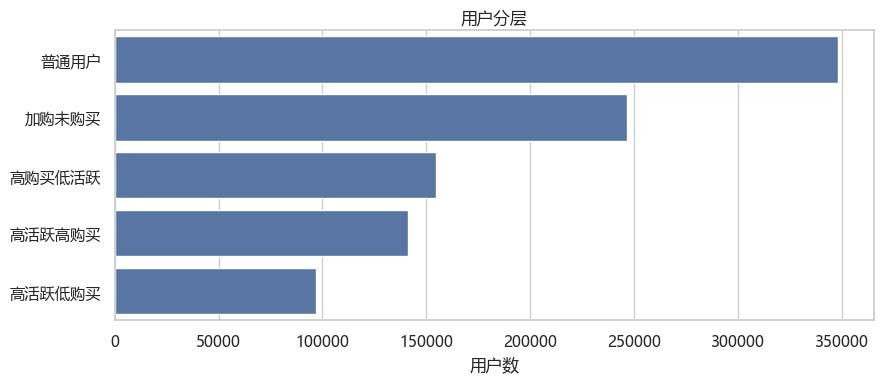

# 淘宝用户行为分析 | Power BI Portfolio

基于淘宝用户行为日志，使用 MySQL、Python/Pandas 和 Power BI 分析用户规模、行为覆盖、活跃时段、类目表现及用户分层。本仓库同时提供可编辑的 Power BI Project（PBIP/TMDL）、SQL 与 Notebook 源码、结果说明和分析图表。

## 看板

| 页面 | 图表与字段 | 指标口径 |
|---|---|---|
| **经营总览** | KPI 卡：`用户数`、`Active Users`、`Buy Users`、`购买转化率`、`PV/UV`；折线图：`date` × `Active Users` | 购买转化率为购买用户 ÷ 浏览用户；PV/UV 为浏览事件数 ÷ 全期去重用户数。首日数据不完整。 |
| **用户行为分析** | 漏斗图：`behavior` × `Active Users`；环图：`behavior` × `Active Users`；柱形图：`hour` × `Active Users` | 浏览、收藏、加购、购买按行为分别去重。同一用户可跨行为重复出现，因此前两图展示用户覆盖，不代表互斥占比或严格顺序转化。 |
| **用户画像分析** | KPI 卡：`Active Users`、`高频购买用户（行为代理）`、`Buy Users`；环图：`behavior` × `Active Users` | 高频购买用户指观察期内至少有 2 条 `buy` 日志的用户；行为分类图是覆盖分布，不是人口统计画像。 |

三页 Power BI 项目文件：[`Taobao_User_Behavior_Portfolio.pbip`](Taobao_User_Behavior_Portfolio.pbip)。打开时须保留同目录下的 `.Report` 和 `.SemanticModel` 文件夹。Power BI 页字段、Measure 与限制详见 [`powerbi/DASHBOARD_SPEC.md`](powerbi/DASHBOARD_SPEC.md) 和 [`powerbi/measures.dax`](powerbi/measures.dax)。

## 分析内容与已保存结果

- SQL 检查原始表 `taobao`（100,150,807 行）及分析表 `taobao_clean`（61,835,998 行），汇总行为、用户、时段、类目、加购未购、用户分层和日趋势。
- Notebook 读取原始 CSV、按北京时间筛选 2017-11-24 至 2017-11-30，并生成小时、类目、加购未购、用户分层和趋势分析。
- 清洗表结果记录 987,994 名用户；浏览用户 980,561，收藏用户 319,169，加购用户 624,346，购买用户 526,239。购买用户 / 浏览用户为 53.67%。
- SQL 与 Notebook 的用户分层算法不同；Notebook 五类用户合计比数据质量汇总少 149 人。Notebook 结果文件注明当前输出未重新运行。
- Power BI 工作副本当前显示约 988 千用户、672 千购买用户、68.33% 购买转化率和 90.81 PV/UV。PBIP 的 M 查询读取原始表 `taobao`；SQL/Python 的结果表针对 2017-11-24 至 2017-11-30 的窗口。两者来源范围不同，但差异的具体贡献尚未量化，因此此处保留各自来源，不把两组数值作为同口径结论。

观察期为 2017-11-24 至 2017-11-30，11 月 24 日是部分日期数据。数据不含订单金额、商品价格、利润、年龄、性别、地区或会话 ID，因此不能支持财务价值、人口统计或同会话转化结论。

## 分析图表

以下为仓库中已有的 SQL/Python 分析图，并非 Power BI 页面截图；图像取自现有分析产物，没有在本次整理中重算。









## 目录

```text
.
├── README.md
├── .gitignore
├── Taobao_User_Behavior_Portfolio.pbip
├── Taobao_User_Behavior_Portfolio.Report/       # 报表页与视觉对象定义
├── Taobao_User_Behavior_Portfolio.SemanticModel/ # TMDL 模型、M 查询与 DAX Measure
├── data/README.md                               # 数据文件放置和授权说明
├── images/                                      # SQL/Python 分析图
├── powerbi/
│   ├── DASHBOARD_SPEC.md
│   └── measures.dax
├── python/
│   ├── 02_taobao_python_analysis.ipynb
│   └── PYTHON_ANALYSIS_RESULTS.md
└── sql/
    ├── 01_taobao_business_analysis.sql
    └── SQL_ANALYSIS_RESULTS.md
```

本地 PBIX（约 1.05 GB）、导入数据和 Power BI 本地缓存被 `.gitignore` 排除；PBIP/TMDL 文本定义纳入仓库。此目录尚未配置 Git remote，也未推送到 GitHub。

## 复现

1. 按 [`data/README.md`](data/README.md) 获取数据，并把原始 CSV 放到 `data/raw/淘宝.csv`。该目录和 CSV 被 Git 忽略，不会上传。
2. 在 MySQL 中将原始 CSV 导入 `taobao_analysis.taobao`，再运行 `sql/01_taobao_business_analysis.sql` 生成窗口分析表和 SQL 汇总。
3. 在 `python/` 目录启动 Jupyter 并打开 `02_taobao_python_analysis.ipynb`。Notebook 的输入路径相对于该目录。
4. 安装 Power BI Desktop 和 MySQL Connector/NET，打开 PBIP。当前 Power Query 连接写为 `localhost`、数据库 `taobao_analysis`、表 `taobao`；在本机准备对应数据后再刷新。

## 技术栈

- **Power BI Desktop / PBIP / TMDL / DAX**：三页交互式报表和语义模型
- **MySQL 8.0 / SQL**：数据检查、清洗结果汇总与业务分析
- **Python / Pandas / Jupyter / Matplotlib / Seaborn**：分时、类目和用户分层分析
- **Git**：源码及报表定义版本管理；大体积数据与 PBIX 排除在仓库外

## 数据来源与公开许可

原始数据文件没有随仓库提供。本机项目资料未保存可核实的下载记录和该数据文件适用的完整授权条款。字段与项目名称和天池官方的[《淘宝用户购物行为数据集》](https://tianchi.aliyun.com/dataset/649?lang=en-us)相符，但仅凭现有文件不能确认本地数据就是该页面所列版本。天池说明数据应按对应数据集协议使用，见[天池数据集使用说明](https://tianchi.aliyun.com/specials/promotion/about)。请在公开数据或声称数据许可前核对实际来源及条款；本仓库不附带原始数据。

仓库未附带代码 License。若需授权他人复用代码，请由项目维护者选择并添加合适的 License 文件；在此之前，不应将仓库理解为已授予再使用许可。

## 发布核验状态

- PBIP、三页定义、TMDL 模型、SQL、Notebook、结果说明和图表文件已整理在本目录。
- PBIP 中可检查三页和 Measure 定义；本次无法在 Power BI Desktop 中重新渲染页面，因此未提供 Power BI 页面截图，也未完成视觉布局的运行时复核。
- Power BI 与 SQL/Python 的购买人数/转化率差异，以及 149 名用户的分层汇总差异仍待数据口径复核。
- 数据集精确来源与再分发许可、代码 License 尚未确认；没有设置远程仓库或执行 GitHub 上传。

